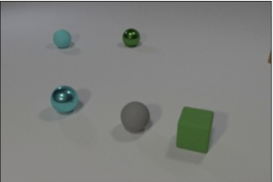
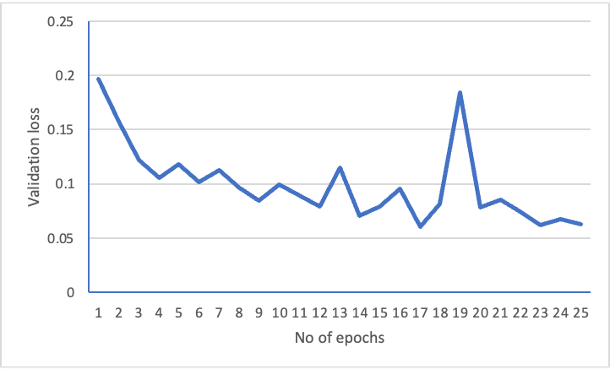
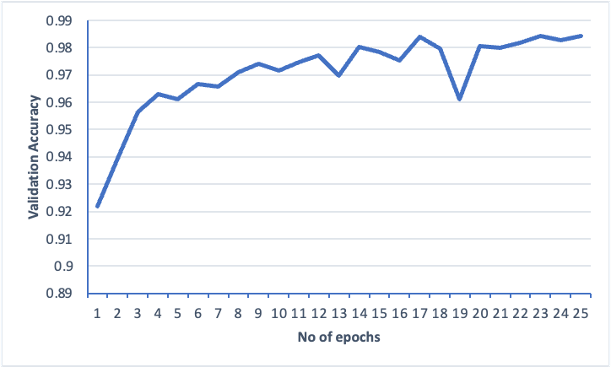
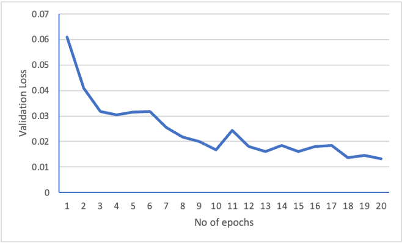
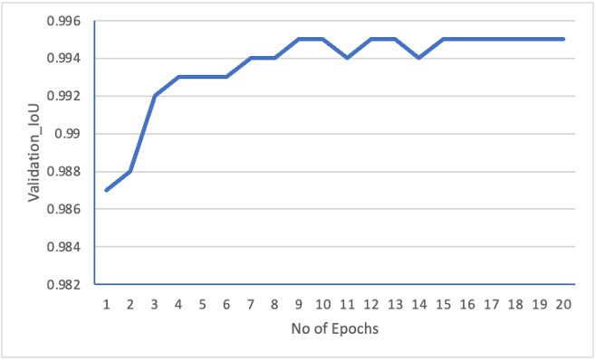

# Transformavericks - Segmentation Instruction
> Sample output of our work-

# Commands to execute
1) apt-get install unzip
2) pip install torch==1.12.0+cu116 torchvision==0.13.0+cu116 torchaudio==0.12.0 --extra-index-url https://download.pytorch.org/whl/cu116 
3) pip install -r requirements.txt

# Dataset Prepartion
Download Dataset_Student_V2.zip and place in this folder where this Readme.Md exists.  
unzip Dataset_Student_V2.zip  
once extracted open jupyter notebook named Data_formatting_for_segmentation.ipynb and run all cells, this will create dataset in required format for training and testing. 

# To train Resnet
python3 train_resnet_on_shapes_dataset.py --train ./Dataset_Student/train/ --val ./Dataset_Student/val  

(Note : The model weights after training will be saved in resnet50_best_model.pth)

# To test Resnet
python3 test_resnet_on_shapes_dataset.py --train ./Dataset_Student/train/ --val ./Dataset_Student/val --weights_path ./resnet50_best_model.pth

(This is for checking the validation accuracy using given weights file)

# To train DeepLabV3Plus

python3 train_deeplabv3plus_for_segmentation.py --train_images ./Dataset_Student/train_flat/ --train_annotations ./Dataset_Student/train_targets_flat/ --val_images ./Dataset_Student/val_flat/  --val_annotations ./Dataset_Student/val_targets_flat/

(Note : The model weights after training will be saved in good_deeplabv3plus_final_scaled.pth)

# To test DeepLabV3Plus

python test_deeplabv3plus_for_segmentation.py --train_images ./Dataset_Student/train_flat/ --train_annotations ./Dataset_Student/train_targets_flat/ --val_images ./Dataset_Student/val_flat/  --val_annotations ./Dataset_Student/val_targets_flat/ --model_path ./good_deeplabv3plus_final_scaled.pth 

(This is for checking the validation IOU using given weights file)

# Instructions to calculate Jaccard Index

Once Segmentation model is trained as future video frames are predicted using Future Frame Prediction Model,  

Run all cells of jupyter notebook "Jaccard_Calculation.ipynb" to generate tensors for calculating jaccardindex on validation set and tensor file for hidden set. 
The tensor files for validation set are gt_tensor_stacked.pth and pred_tensor_stacked.pth 
The tensor file for hidden set is hidden_set_predicted_masks.pth and can be compared against ground_truth. 

The above two files can be used for calculating jaccard index on validation set using python program jaccard_calculation.py  
python3 jaccard_calculation.py 
 
(Note: use a sepearte virtual environment for running python3 jaccard_calculation.py  as it requires torchmetrics==0.11.4)

# Results

<!-- # First install pytorch with torch vision etc with this command
pip install torch==1.12.0+cu116 torchvision==0.13.0+cu116 torchaudio==0.12.0 --extra-index-url https://download.pytorch.org/whl/cu116 
pretrainedmodels pip install requirements.txt
segementation_models pip install requirements.txt

pip install torchmetrics==0.7
pip install pytorch-lightning==1.5.4
pip install torchtext==0.6.0
pip install matplotlib

pip install gdown

pip install jupyter -->

<!-- python train_resnet_on_shapes_dataset.py --train ./Dataset_Student/train/ --val ./Dataset_Student/val

python test_resnet_on_shapes_dataset.py --train ./Dataset_Student/train/ --val ./Dataset_Student/val --weights_path ./resnet50_best_model.pth -->

<!-- python train_deeplabv3plus_for_segmentation.py --train_images ./Dataset_Student/train_flat/ --train_annotations ./Dataset_Student/train_targets_flat/ --val_images ./Dataset_Student/val_flat/  --val_annotations ./Dataset_Student/val_targets_flat/

python test_deeplabv3plus_for_segmentation.py --train_images ./Dataset_Student/train_flat/ --train_annotations ./Dataset_Student/train_targets_flat/ --val_images ./Dataset_Student/val_flat/  --val_annotations ./Dataset_Student/val_targets_flat/ --model_path ./good_deeplabv3plus_final_scaled.pth  -->

