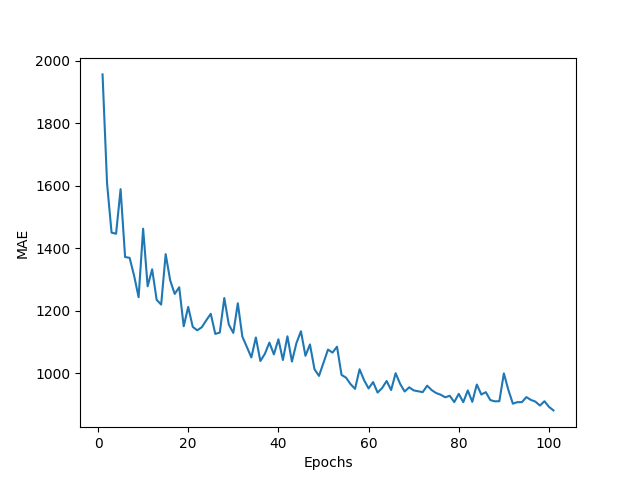
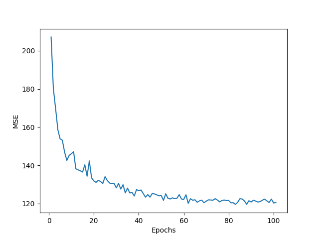
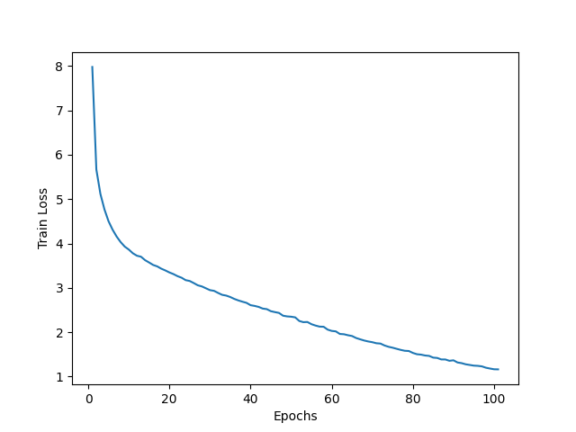
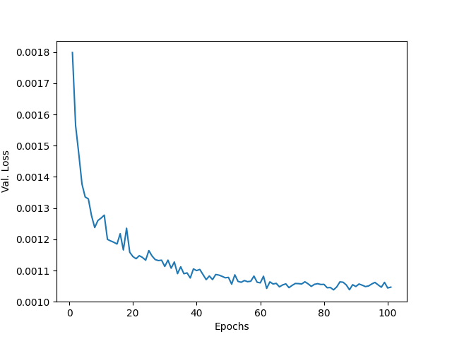

# Transformavericks - Video Frame Prediction
> Sample output of our work-

# Commands to execute

1) apt-get install unzip
2) pip install -r requirements.txt
3) pip install opencv-python gdown
4) apt-get update && apt-get install ffmpeg libsm6 libxext6  -y
5) python setup.py develop
6) **!!IMPORTANT!! Please go through [this notebook](./Download%20Large%20Files.ipynb) to download the dataset and all related files.**
# To train
 python tools/train.py -d shapes -m SimVP --model_type moga -c configs/mmnist/simvp/SimVP_MogaNet.py --ex_name shapes_simvp_moga
 
# To test 
python tools/test.py -d shapes -m SimVP --model_type moga -c configs/mmnist/simvp/SimVP_MogaNet.py --ex_name shapes_simvp_moga --testdir ./Dataset_Student/val

(The files will be saved in val_outputs if the argument --testdir ./Dataset_student/val)
(The files will be saved in hidden_outputs if the argument --testdir ./Dataset_student/hidden)

# Results

